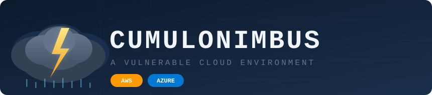

<div align="center">



---

> ⚠️ **Warning:** This cyber range deploys intentionally vulnerable infrastructure.
> Do **not** use it in production or in an environment with sensitive data.

> 💸 **Cost notice:** Deploying a lab provisions **real cloud infrastructure** on your AWS or Azure account.
> Charges will be incurred. Always destroy labs when you are done:
> `cnimbus <provider> destroy --app-id <app-id>`

</div>

---

## Available Labs

<details>
<summary><strong>🔵 Azure Labs — 29 challenges</strong></summary>

<br>

**Beginner**

| App ID | Category |
|--------|----------|
| [`sa_public_access`](app/cumulonimbus/applications/azure/sa_public_access/README.md) | Storage Misconfiguration |
| [`blob_sas_abuse`](app/cumulonimbus/applications/azure/blob_sas_abuse/README.md) | Storage / Credential Exposure |
| [`app_service_env_vars`](app/cumulonimbus/applications/azure/app_service_env_vars/README.md) | Web / Secrets |
| [`container_instance_env`](app/cumulonimbus/applications/azure/container_instance_env/README.md) | Containers / Secrets |
| [`container_app_env_vars`](app/cumulonimbus/applications/azure/container_app_env_vars/README.md) | Containers / Secrets |
| [`resource_group_tags`](app/cumulonimbus/applications/azure/resource_group_tags/README.md) | Identity / Secrets |
| [`app_configuration_secrets`](app/cumulonimbus/applications/azure/app_configuration_secrets/README.md) | Configuration / Secrets |
| [`vm_extension_settings`](app/cumulonimbus/applications/azure/vm_extension_settings/README.md) | Compute / Secrets |
| [`apim_named_value`](app/cumulonimbus/applications/azure/apim_named_value/README.md) | API Management / Secrets |
| [`deployment_script`](app/cumulonimbus/applications/azure/deployment_script/README.md) | IaC / Data Exposure |
| [`policy_assignment_metadata`](app/cumulonimbus/applications/azure/policy_assignment_metadata/README.md) | Governance / Secrets |
| [`monitor_action_group`](app/cumulonimbus/applications/azure/monitor_action_group/README.md) | Monitoring / Secrets |

**Intermediate**

| App ID | Category |
|--------|----------|
| [`cloudshell`](app/cumulonimbus/applications/azure/cloudshell/README.md) | Storage / RBAC |
| [`illicit_consent_grant`](app/cumulonimbus/applications/azure/illicit_consent_grant/README.md) | Identity / OAuth Phishing |
| [`managed_identity_abuse`](app/cumulonimbus/applications/azure/managed_identity_abuse/README.md) | Compute / IMDS |
| [`keyvault_misconfig`](app/cumulonimbus/applications/azure/keyvault_misconfig/README.md) | Key Vault / Access Policy |
| [`automation_account`](app/cumulonimbus/applications/azure/automation_account/README.md) | Automation / Managed Identity |
| [`function_ssrf`](app/cumulonimbus/applications/azure/function_ssrf/README.md) | Serverless / SSRF / IMDS |
| [`terraform_state_exposure`](app/cumulonimbus/applications/azure/terraform_state_exposure/README.md) | Storage / Secrets in State |
| [`arm_deployment_history`](app/cumulonimbus/applications/azure/arm_deployment_history/README.md) | ARM / Credential Exposure |
| [`exposed_app_registration`](app/cumulonimbus/applications/azure/exposed_app_registration/README.md) | Identity / Credential Exposure |
| [`storage_account_keys`](app/cumulonimbus/applications/azure/storage_account_keys/README.md) | Storage / Privilege Escalation |
| [`vm_run_command`](app/cumulonimbus/applications/azure/vm_run_command/README.md) | Compute / Privilege Escalation |
| [`eventgrid_webhook_token`](app/cumulonimbus/applications/azure/eventgrid_webhook_token/README.md) | Integration / Secrets |
| [`logic_app_credentials`](app/cumulonimbus/applications/azure/logic_app_credentials/README.md) | Integration / Secrets |
| [`data_factory_linked_service`](app/cumulonimbus/applications/azure/data_factory_linked_service/README.md) | Integration / Secrets |

**Advanced**

| App ID | Category |
|--------|----------|
| [`add_sp_credentials`](app/cumulonimbus/applications/azure/add_sp_credentials/README.md) | Identity / Privilege Escalation |
| [`foci`](app/cumulonimbus/applications/azure/foci/README.md) | Identity / OAuth Token Abuse |
| [`shared_key_auth`](app/cumulonimbus/applications/azure/shared_key_auth/README.md) | Storage / Function App / Key Vault |

</details>

<details>
<summary><strong>🟠 AWS Labs — 24 challenges</strong></summary>

<br>

**Beginner**

| App ID | Category |
|--------|----------|
| [`ec2_ssrf`](app/cumulonimbus/applications/aws/ec2_ssrf/README.md) | SSRF / IMDS |
| [`s3_public_access`](app/cumulonimbus/applications/aws/s3_public_access/README.md) | Storage / Misconfiguration |
| [`s3_object_public_acl`](app/cumulonimbus/applications/aws/s3_object_public_acl/README.md) | Storage / Misconfiguration |
| [`s3_bucket_versioning`](app/cumulonimbus/applications/aws/s3_bucket_versioning/README.md) | Storage / Versioning |
| [`lambda_env_secrets`](app/cumulonimbus/applications/aws/lambda_env_secrets/README.md) | Serverless / Credential Exposure |
| [`lambda_function_url`](app/cumulonimbus/applications/aws/lambda_function_url/README.md) | Serverless / Exposure |
| [`ec2_userdata_secrets`](app/cumulonimbus/applications/aws/ec2_userdata_secrets/README.md) | Compute / Credential Exposure |
| [`cloudformation_stack`](app/cumulonimbus/applications/aws/cloudformation_stack/README.md) | Infrastructure / Secrets |
| [`glue_job_secrets`](app/cumulonimbus/applications/aws/glue_job_secrets/README.md) | Data / Secrets |
| [`sqs_public_receive`](app/cumulonimbus/applications/aws/sqs_public_receive/README.md) | Messaging / Misconfiguration |
| [`codebuild_env_vars`](app/cumulonimbus/applications/aws/codebuild_env_vars/README.md) | CI/CD / Secrets |
| [`route53_records`](app/cumulonimbus/applications/aws/route53_records/README.md) | DNS / Data Exposure |
| [`dynamodb_scan`](app/cumulonimbus/applications/aws/dynamodb_scan/README.md) | Database / Data Exposure |
| [`amplify_env_vars`](app/cumulonimbus/applications/aws/amplify_env_vars/README.md) | Frontend / Secrets |
| [`appconfig_deployment`](app/cumulonimbus/applications/aws/appconfig_deployment/README.md) | Configuration / Secrets |

**Intermediate**

| App ID | Category |
|--------|----------|
| [`secrets_manager_enum`](app/cumulonimbus/applications/aws/secrets_manager_enum/README.md) | IAM / Secrets Management |
| [`ssm_parameter_store`](app/cumulonimbus/applications/aws/ssm_parameter_store/README.md) | IAM / Secrets Management |
| [`sts_assume_role_any`](app/cumulonimbus/applications/aws/sts_assume_role_any/README.md) | IAM / Privilege Escalation |
| [`cognito_identity_pool`](app/cumulonimbus/applications/aws/cognito_identity_pool/README.md) | Identity / Credential Abuse |
| [`ssm_session_manager`](app/cumulonimbus/applications/aws/ssm_session_manager/README.md) | Compute / Lateral Movement |
| [`ecs_exec`](app/cumulonimbus/applications/aws/ecs_exec/README.md) | Containers / Lateral Movement |
| [`kinesis_shard_reader`](app/cumulonimbus/applications/aws/kinesis_shard_reader/README.md) | Streaming / Data Exposure |
| [`stepfunctions_execution_history`](app/cumulonimbus/applications/aws/stepfunctions_execution_history/README.md) | Serverless / Data Exposure |

**Advanced**

| App ID | Category |
|--------|----------|
| [`iam_privesc`](app/cumulonimbus/applications/aws/iam_privesc/README.md) | IAM / Privilege Escalation |

</details>

---

## Quick Start

The easiest way to run Cumulonimbus is via the Docker container, which bundles all
dependencies (Terraform, AWS CLI, Azure CLI).

```shell
docker run -it cumulonimbuscloud/cumulonimbus:latest
```

Or build locally:

```shell
docker build -t cumulonimbus .
docker run -it cumulonimbus
```

---

## Prerequisites

You need a cloud account with sufficient permissions before deploying labs.

**Azure** — create a service principal with:
- Global Administrator role (Entra ID level)
- Owner on the target subscription
- Key Vault Administrator on the target subscription
- Security defaults disabled
- Microsoft Graph application permissions (admin consented): `User.ReadWrite.All`, `Application.ReadWrite.All`, `Directory.ReadWrite.All`

> Grant Graph permissions: Azure Portal → App registrations → your app → API permissions → Add a permission → Microsoft Graph → Application permissions → select the permissions above → Grant admin consent

**AWS** — an IAM user or role with:
- `AdministratorAccess` (or at minimum EC2, S3, and IAM full access)

---

## CLI Reference

### Authenticate

```shell
# Azure
cnimbus azure authenticate --service-principal \
  --client-id <id> --client-secret <secret> \
  --tenant-id <tenant> --subscription-id <subscription> \
  --tenant-domain <domain>          # e.g. contoso.onmicrosoft.com

# AWS
cnimbus aws authenticate \
  --access-key-id <key-id> --secret-access-key <secret> \
  [--session-token <token>]
```

### Deploy a lab

```shell
cnimbus azure create --app-id <app-id>
cnimbus aws   create --app-id <app-id>
```

### Destroy a lab

```shell
cnimbus azure destroy --app-id <app-id>
cnimbus aws   destroy --app-id <app-id>
```

### Validate a captured flag

```shell
cnimbus azure validate --app-id <app-id> --flag "CUMULONIMBUS{...}"
cnimbus aws   validate --app-id <app-id> --flag "Cumulonimbus{...}"
```

### Get a hint

```shell
# Level 1 = gentle nudge, 2 = moderate, 3 = explicit
cnimbus azure hint --app-id <app-id> --level 1
cnimbus aws   hint --app-id <app-id> --level 2
```

---

## CTFd Integration

A self-hosted CTFd instance can be used to score flag submissions across teams.
See [`ctfd/README.md`](ctfd/README.md) for setup instructions.

```shell
cd ctfd
docker compose up -d
python seed_challenges.py --url http://localhost:8000 --admin-token <token>
```

---

## For more help

```shell
cnimbus -h
cnimbus azure -h
cnimbus aws -h
```
